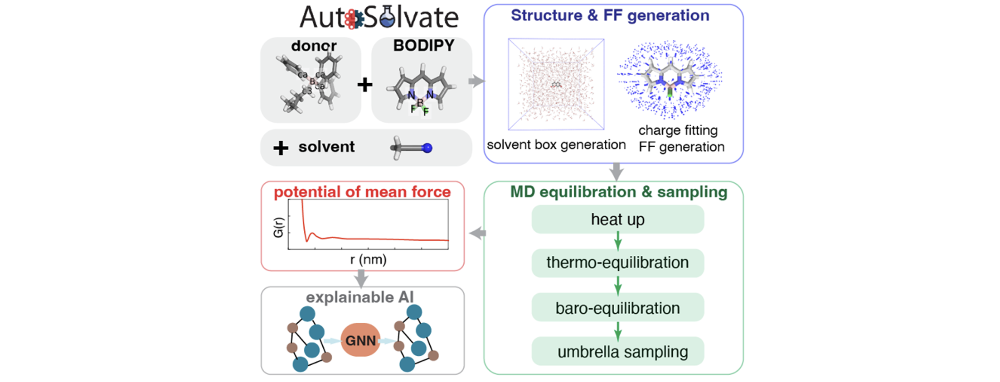

# Workflow-for-Umbrella-Sampling

## Overview

This project provides an automated protocol for Umbrella Sampling Simulation which generates potential mean forces (PMF) as function of COM distance of the interested molecules. By following this protocol, users can efficiently generate PMF profile from their XYZ coordinates or pdb file. 

The process involves several steps, including setting up AutoSolvate virtual environment, installing necessary dependencies, running the main script to generate a solvent box, minimization, heating, equilibration, pulling, constrained MD simulation and finally histrogram analysis with WHAM. These steps are designed to streamline the workflow and provide a comprehensive solution for generation PMF profile.

## Authors

Mohammad Pabel Kabir, Fang Liu

## Requirements

> AMBER16 or above

> AutoSolvate (https://autosolvate.readthedocs.io/en/latest/)

> Packmol (https://m3g.github.io/packmol/)

> WHAM (http://membrane.urmc.rochester.edu/content/wham)

## Workflow Description

### Step 1: Parameter File Generation for Individual Systems

Prepare a starting coordinates file (pdb or xyz) for the molecules for which you would like to generate an AIIM. Use antechamber to create AMBER parameters for the two systems and the solvent. Here, we use the example of BODIPY (system1) and TPAB (system2) molecules in ACN solvent:

antechamber -i system1.pdb -fi pdb -o system1.mol2 -fo mol2 -c bcc -s 2

antechamber -i system2.pdb -fi pdb -o system2.mol2 -fo mol2 -c bcc -s 2

antechamber -i solvent.pdb -fi pdb -o solvent.mol2 -fo mol2 -c bcc -s 2

Convert the resulting mol2 into an AMBER library file: tleap -f convert.leap

After this, you should have the following files: solvent.frcmod, solvent.prep, solvent.pdb, system1.lib, system1.frcmod, system1.pdb, system2.lib, system2.frcmod, system2.pdb

Note: Since both BODIPY and TPAB molecules contain a boron (B) atom, and the parameter for the B atom is not available in the Gaff force field, force field fitting is required. For our case, we did force field fitting to generate the parameter files.

### Step 2: Solvent Box and Parameter Generation for the Whole System

Generate solvent box coordinates using the packmol.py script, which employs Packmol to place system1 and system2 in the solvent and creates a solvated.pdb file:

python 1.packmol.py

Generate parameter file for the whole system with the tleap.sh script, which uses tleap tools, loads parameter files for individual systems and generate parameter file for the whole system:

tleap -f 2.tleap.sh

This will generate system.pdb, system.parm, and system.rst files

Note: Step 1 and Step 2 can be done with our in-house automated software AutoSolvate.

### Step 3: Minimization, Heating, Equilibration and Pulling Simulation

The two systems initially positioned with a center of mass (COM) distance of 4.5 Šwithin an 80x80x80 Šcubic solvent box filled with acetonitrile (ACN) solvent (or interested solvent) and subjected to periodic boundary conditions. To ensure the stability of the system, 1000 cycles of energy minimization were performed using the steepest descent method for first 500 steps followed by the conjugate gradient method for the remaining steps. The system then underwent a controlled heating process using Langevin dynamics, with the temperature gradually increased from 0 K to 100 K over 25,000 steps  of 0.05 fs each (nstlim = 25000, dt = 0.00005) with a high collision frequency of 500 ps-1 and from 100 K to 300 K over 10,000 steps of 2 fs each (nstlim = 25000, dt = 0.002) with a collision frequency of 1 ps-1. Subsequently, the system was equilibrated at 300 K and 1.013 bar for 500 ps using the Berendsen barostat with a 2 ps relaxation time, with a 1.0 kcal/mol-Ų harmonic constraint potential applied to maintain the TPAB/BODIPY COM below 0.45 nm. Finally, a pulling simulation was performed to pull the TPAB molecule steadily at a rate of 0.01 nm/ps with a harmonic potential of 1.0 kcal/mol-Ų. 

python 3.min_heat_equi_pull.py

### Step 4: Windows (Constrained MD Simulation)

From the pulling trajectory, 33 configurations will be selected at 0.1 nm intervals, with COM separation ranging from 0.45 nm to 3.65 nm, as starting points for the umbrella sampling simulations. Umbrella sampling was then carried out on these 33 configurations by fixing the positions of system1 and system2 with 0.5 kcal/mol-Ų harmonic potentials and simulating for 2 ns. Energies were saved every 1 ps.

python 4.windows.py

### Step 5: PMF Profile Generation

From the constrained MD simulation, Weighted histogram analysis method (WHAM) was used to calculate PMF profile.

python 5.pmf.py

## Getting Started

To begin using this workflow, clone the repository and navigate to the root directory. Ensure that all required Python libraries (`NumPy`, `Cython`, `pyvdwsurface`, etc.) are installed. Follow the steps outlined in the README files within each directory to execute the workflow successfully.

## Contributions

Contributions to this workflow are welcome. If you have suggestions for improvement or encounter any issues, please feel free to open an issue or submit a pull request.

## License

This project is licensed under the MIT License. See the [LICENSE](LICENSE.md) file for more details.
